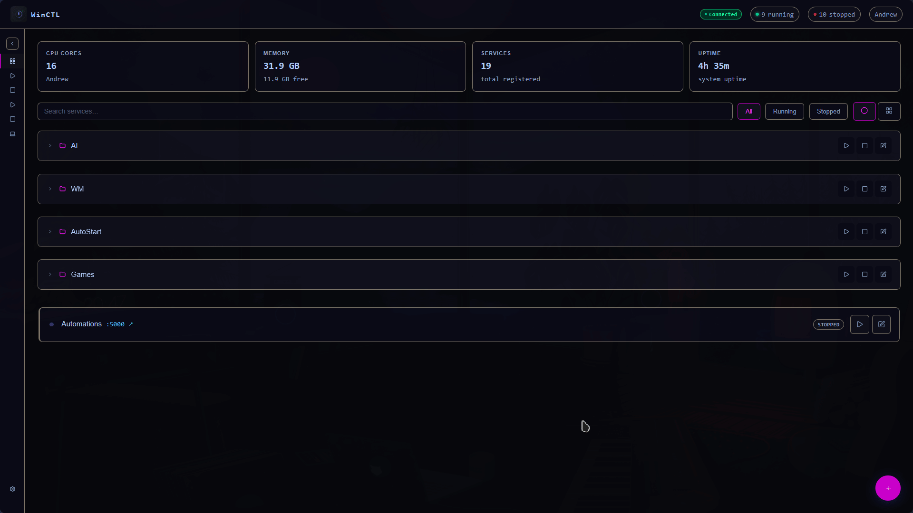

<div align="center">


# WinCTL

**Self-hosted Windows process manager with a beautiful web dashboard**

[](LICENSE)
[]()
[]()
[]()

[**Download**](#-quick-start) · [**Features**](#-features) · [**Screenshots**](#-screenshots) · [**CLI**](#%EF%B8%8F-cli-reference) · [**License**](#-license)

</div>

---

<div align="center">



</div>

---

## ✨ Features

| | |
|---|---|
| 🖥️ **Web Dashboard** | Mobile-friendly UI accessible from any browser on your network |
| ▶️ **Process Control** | Start, stop, and restart any process with one click |
| 📋 **Real-time Logs** | Live streaming stdout/stderr per service, right in the browser |
| 🔄 **Auto-restart** | Automatically re-launch crashed services with exponential backoff |
| 🚀 **Auto-start at Boot** | Launch selected services automatically when WinCTL starts |
| 📁 **Folders** | Group related services into collapsible folders |
| 🎨 **14 Built-in Themes** | Dark, light, and popular community themes — plus a custom theme creator |
| 🔔 **System Tray** | Runs silently in the background with a tray icon |
| ⌨️ **CLI** | Full command-line control via `winctl` commands |
| 🔗 **Port Links** | Clickable links that open services directly in the browser |
| 💾 **Persistent Config** | All services saved to `~\.winctl\services.json` |
| 📊 **System Stats** | Live CPU, RAM, hostname, and uptime at a glance |
| 🚫 **No Docker / WSL** | Runs natively on Windows — just two `.exe` files |

---

## 📸 Screenshots

<div align="center">

| Gallery View | List View |
|:-:|:-:|
|  |  |

</div>

---

## ⚡ Quick Start

### 1. Download

Grab the latest release from the [**Releases**](https://github.com/Andrew-0807/winctl/releases) page and place both files in the same folder (e.g. `C:\winctl\`):

```
winctl.exe          ← CLI / launcher
winctl-daemon.exe   ← background server
```

### 2. Initialize

Open a terminal **in that folder** and run:

```bat
winctl init
```

This adds `winctl` to your PATH and optionally installs WinCTL as a Windows Service so it survives reboots.

### 3. Start

```bat
winctl start
```

Then open **<http://localhost:8080>** in any browser. From your phone or tablet on the same network use `http://<your-pc-ip>:8080`.

> **Find your PC's IP:** run `ipconfig` in cmd and look for _IPv4 Address_.

---

## 🖥️ CLI Reference

All commands work from any terminal once `winctl init` has been run.

| Command | Description |
|---|---|
| `winctl start` | Start the WinCTL daemon (Windows Service or standalone) |
| `winctl stop` | Gracefully stop the daemon |
| `winctl stop -f` | Force-kill the daemon immediately |
| `winctl stop -p <port>` | Stop the daemon running on a specific port |
| `winctl status` | Show daemon status and all managed services |
| `winctl services` | List managed services with status, PID, and port |
| `winctl start-svc <id\|name>` | Start a managed service |
| `winctl stop-svc <id\|name>` | Stop a managed service |
| `winctl restart-svc <id\|name>` | Restart a managed service |
| `winctl logs <id\|name>` | Print recent logs for a service |
| `winctl open` | Open the web UI in the default browser |
| `winctl setup-firewall` | Add a Windows Firewall rule (run as Admin) |
| `winctl init` | Add `winctl.exe` to user PATH and install service |
| `winctl help [command]` | Show help for all commands or a specific one |

> Services can be identified by their **name** (case-insensitive) or **ID**.

---

## ⚙️ Configuration

### Config files

All configuration is stored in `%USERPROFILE%\.winctl\`:

| File | Contents |
|---|---|
| `services.json` | All services, folders, and their settings |
| `settings.json` | App-wide preferences (theme, folder state, auto-start) |
| `themes\` | Built-in and custom theme JSON files |
| `winctl.log` | Daemon startup and error log |

### Per-service fields

| Field | Description |
|---|---|
| `name` | Display name shown in the dashboard |
| `command` | Executable or command (e.g. `node`, `python`, `C:\myapp\app.exe`) |
| `args` | Command-line arguments (e.g. `server.js --port 3000`) |
| `cwd` | Working directory the process starts in |
| `port` | Optional — creates a clickable link to `localhost:PORT` |
| `autoRestart` | Re-launch automatically if the process exits with a non-zero code |
| `autoStart` | Launch this service when WinCTL starts |

### Change the port

Set the `WINCTL_PORT` environment variable before starting (default: `8080`):

```bat
set WINCTL_PORT=3500 && winctl start
```

### Allow access from other devices

Run the following command **as Administrator** once:

```bat
netsh advfirewall firewall add rule name="WinCTL" dir=in action=allow protocol=TCP localport=8080
```

Or use the built-in shortcut: `winctl setup-firewall` (requires Admin).

---

## 🎨 Themes

WinCTL ships with **14 built-in themes**:

| | | | |
|---|---|---|---|
| Dark Default | Light Default | Midnight Blue | Forest Green |
| Sunset Warm | Nord | Dracula | Solarized Dark |
| Monokai | Cyberpunk | Catppuccin Mocha | Gruvbox Dark |
| Tokyo Night | Rosé Pine | Everforest | |

You can also build your own theme using the **Theme Creator** in Settings — customize every color and save it with a name.

---

## 📋 Requirements

- **Windows 10 or 11** (64-bit)
- No Node.js, Docker, WSL, or Linux required for the `.exe` release

---

## 📄 License

<div align="center">

[](LICENSE)

**© 2025 Andrew-0807**

This project is licensed under the **Creative Commons Attribution-NonCommercial 4.0 International** license.

✅ Free to use and share for **personal and non-commercial purposes**
✅ Attribution required — credit the original author
❌ **Commercial use is not permitted**
❌ Selling, repackaging, or monetising this software is prohibited

[View full license →](LICENSE)

</div>
